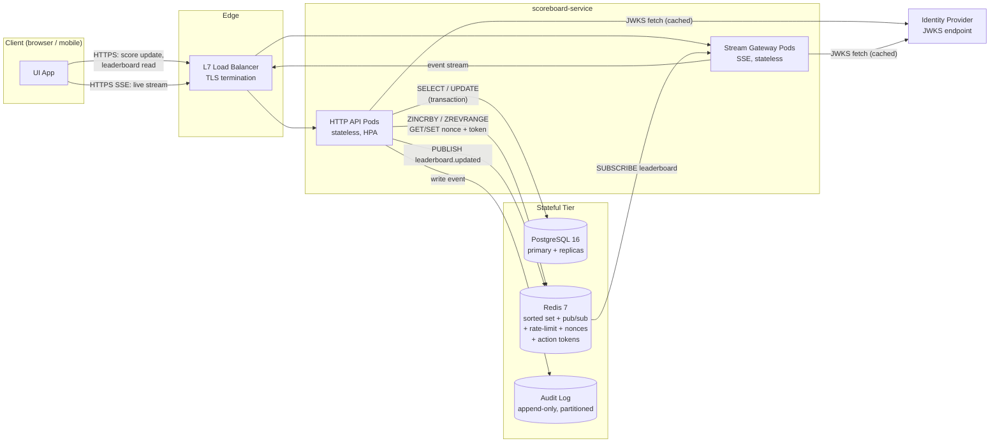
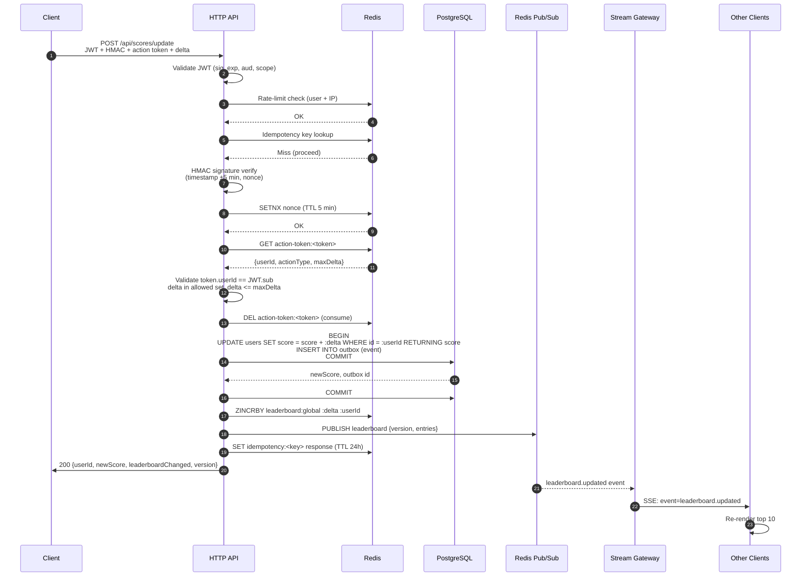
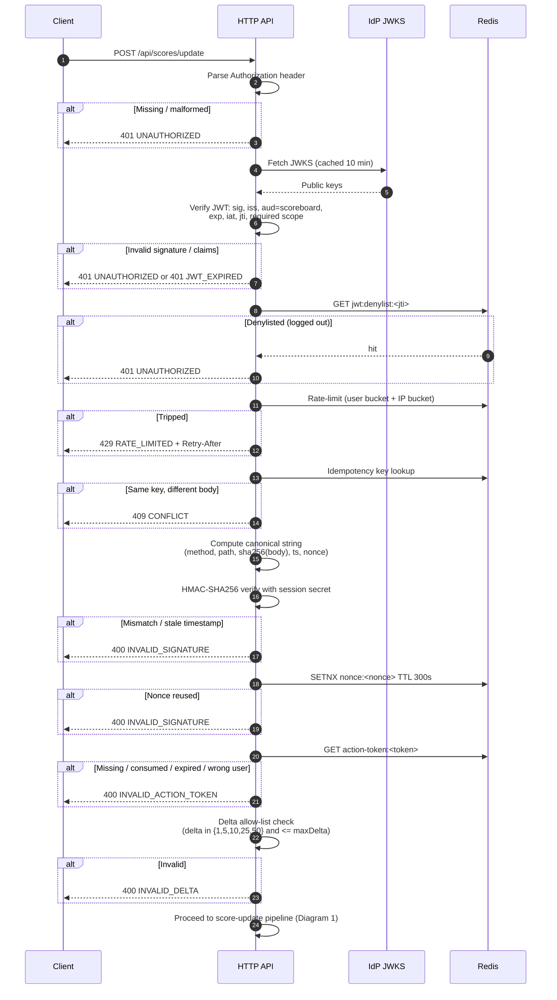
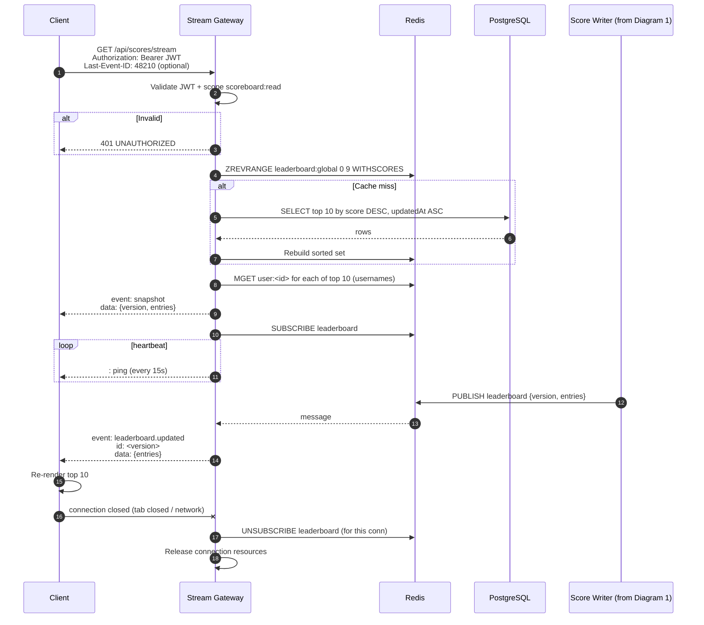

# Score Board API Service — Module Specification

Problem 6 of the 99Tech Backend Developer code challenge. This document is the implementation-ready specification for a backend module that powers a live top-10 scoreboard with authenticated, tamper-resistant score updates. It is intended to be handed directly to a backend engineering team; every design choice with alternatives carries a one-sentence justification.

---

## 1. Module Overview

**Module name:** `scoreboard-service`

**Purpose.** Accept authenticated score-increment requests from clients, persist them durably, and broadcast the current top 10 users to all connected clients in real time (no polling). The service owns the read and write path for score state and the live fan-out channel; it does not own the user action that earns the score, nor the identity provider.

### In scope

- `POST /api/scores/update` — authenticated, signed, single-use-token score increment.
- `GET /api/scores/leaderboard` — cacheable top-10 snapshot.
- `GET /api/scores/stream` — live top-10 channel (SSE; see §3.3).
- Action-token minting endpoint (referenced by §5.3, issued at action-start by whatever service drives the action — endpoint surface documented here for symmetry).
- Anti-abuse controls: JWT, HMAC payload signing, single-use action tokens, rate limiting, delta allow-list, idempotency.
- Redis-backed hot leaderboard, PostgreSQL source of truth, Redis pub/sub fan-out.
- Audit logging of every update attempt.

### Out of scope

- The action the user performs to earn score (game loop, quiz, purchase, etc.).
- Identity provider / login UI / password management — an upstream IdP issues JWTs; this service only validates them.
- Long-term analytics warehouse, BI, reporting dashboards.
- Anti-fraud ML models, device fingerprinting, bot detection at the network edge.
- Mobile push notifications, email, SMS.
- Tenant / org management (the spec is single-tenant; multi-tenant is a §9 extension).

### Assumptions & constraints

- **Auth upstream.** A trusted identity service issues short-lived (15 min) RS256-signed JWTs. Public keys are published via JWKS at a known URL, rotated monthly.
- **Score domain.** Score is a non-negative 64-bit integer. Increments only (no decrements in v1; corrections happen via admin tooling, out of scope).
- **Leaderboard size.** Fixed at 10. Ties are broken by most-recent `updatedAt` ascending (earlier update wins on tie).
- **Scale targets.** 2,000 write QPS peak, 20,000 read QPS peak, 50,000 concurrent live-stream subscribers.
- **Latency SLOs.** Leaderboard read p95 < 50 ms, live-update fan-out p95 < 500 ms end-to-end from commit to client render.
- **Consistency.** The PostgreSQL row is the source of truth. Redis is a cache + fan-out bus; on cache miss the service rebuilds the sorted set from the DB.
- **Availability.** 99.9% monthly for the read path; 99.5% for the write path (tighter budget on reads because the UI depends on them).
- **Deployment target.** Kubernetes, with Redis and Postgres as managed services.

---

## 2. System Architecture

### Components

| Component | Stateful? | Replaceable? | Scales |
|---|---|---|---|
| L7 Load Balancer | No | Yes (swap for any HTTP LB) | N/A |
| API service (HTTP) | No | Yes | Horizontal, stateless |
| Stream gateway (SSE) | Soft state (open connections) | Yes | Horizontal, sticky not required (Redis pub/sub fans out to every pod) |
| PostgreSQL 16 primary + read replicas | Yes | No (authoritative store) | Vertical + read replicas |
| Redis 7 (cache + pub/sub + rate-limit + nonce + action-token) | Yes (ephemeral) | Yes (rebuildable from PG) | Redis Cluster |
| Audit log sink | Yes (append-only) | Yes | Partitioned by month |
| Identity Provider (IdP) | External | Out of scope | N/A |

The API tier and the stream gateway are separate deployments sharing the same codebase; they can colocate in one process for small environments. The DB is the only hard scaling bottleneck; Redis and the API tier scale horizontally.

### Container diagram



### Horizontal scaling notes

- **API pods**: stateless, scale on CPU + request QPS.
- **Stream gateway pods**: each pod holds N open SSE connections (soft state). Scale on connection count; no sticky sessions required because every pod subscribes to the same Redis pub/sub channel and receives every event.
- **Redis**: start single-node primary with replica for HA; move to Redis Cluster once the sorted set exceeds ~100 MB or pub/sub fan-out becomes the bottleneck.
- **Postgres**: primary handles writes; read replicas handle cache-miss rebuilds and audit queries via PgBouncer.

---

## 3. API Specification

All endpoints use JSON over HTTPS. `Content-Type: application/json; charset=utf-8`. Timestamps are RFC 3339 UTC strings. IDs are UUID v7 strings.

### Common headers (write endpoints)

| Header | Required | Notes |
|---|---|---|
| `Authorization` | Yes | `Bearer <JWT>`, never query string. |
| `Idempotency-Key` | Yes | Client-generated UUID v4, stored for 24 h. |
| `X-Signature` | Yes | HMAC-SHA256 base64url; see §5.2. |
| `X-Timestamp` | Yes | Unix seconds, ±300 s tolerance. |
| `X-Nonce` | Yes | Single-use within the timestamp window. |
| `X-Request-Id` | Optional | Echoed back for correlation; generated if absent. |

### 3.1 `POST /api/scores/update`

Increments the authenticated user's score by `delta`. Requires JWT + HMAC + action token (§5).

**Auth requirement:** JWT scope `scoreboard:write`, `sub` claim identifies the user.

**Rate limit:** 30 req/min per user, 120 req/min per IP, token-bucket in Redis (sliding-window counters via `redis-rate-limit`-style `INCR` + `EXPIRE` — chosen for simplicity and O(1) cost over the more accurate but costlier sorted-set sliding log).

**Idempotency:** `Idempotency-Key` header required; duplicate key with the same body returns the cached response, duplicate key with a different body returns `409 CONFLICT`.

**Request body (OpenAPI 3.0):**

```yaml
ScoreUpdateRequest:
  type: object
  required: [delta, actionToken, actionId]
  additionalProperties: false
  properties:
    delta:
      type: integer
      description: Amount to add to the user's score. Must be in the allowed set for the bound actionType.
      enum: [1, 5, 10, 25, 50]
    actionToken:
      type: string
      description: Server-minted single-use token bound to {userId, actionType, maxDelta}. Redeemed on this call.
      minLength: 32
      maxLength: 128
    actionId:
      type: string
      format: uuid
      description: Client-assigned unique id for the action instance (for audit correlation).
```

**Success response 200 (OpenAPI 3.0):**

```yaml
ScoreUpdateResponse:
  type: object
  required: [userId, newScore, leaderboardChanged, version]
  properties:
    userId:
      type: string
      format: uuid
    newScore:
      type: integer
      minimum: 0
    leaderboardChanged:
      type: boolean
      description: True if this update caused a change in the top-10 membership or ordering.
    version:
      type: integer
      description: Monotonic leaderboard version; clients use it to reconcile out-of-order live events.
```

**Error response (OpenAPI 3.0):**

```yaml
ErrorEnvelope:
  type: object
  required: [error]
  properties:
    error:
      type: object
      required: [code, message, requestId]
      properties:
        code:
          type: string
          example: INVALID_DELTA
        message:
          type: string
        requestId:
          type: string
        details:
          type: object
          additionalProperties: true
```

### 3.2 `GET /api/scores/leaderboard`

Returns the current top 10.

**Auth requirement:** JWT, scope `scoreboard:read`. (Public read is a §9 option; v1 requires a valid session to avoid leaking usernames to scrapers.)

**Rate limit:** 600 req/min per user (10 rps) — high because UIs reload on tab focus.

**Response headers:**

- `Cache-Control: public, max-age=5, stale-while-revalidate=25`.
  - `max-age=5`: one leaderboard UI refresh every 5 s is acceptable and this collapses thundering-herd on hot events.
  - `stale-while-revalidate=25`: the CDN can serve stale for up to 30 s total while the origin refreshes, bounding origin load during traffic spikes.
- `ETag` based on `version`; clients may send `If-None-Match` for 304.

**Response body (OpenAPI 3.0):**

```yaml
LeaderboardResponse:
  type: object
  required: [entries, version, emittedAt]
  properties:
    entries:
      type: array
      minItems: 0
      maxItems: 10
      items:
        $ref: '#/components/schemas/LeaderboardEntry'
    version:
      type: integer
    emittedAt:
      type: string
      format: date-time
LeaderboardEntry:
  type: object
  required: [rank, userId, username, score]
  properties:
    rank:
      type: integer
      minimum: 1
      maximum: 10
    userId:
      type: string
      format: uuid
    username:
      type: string
    score:
      type: integer
      minimum: 0
```

### 3.3 Live update channel — `GET /api/scores/stream`

**Chosen transport: Server-Sent Events (SSE).** WebSockets are the classic alternative and go into §9 as an upgrade path.

**Justification.** The scoreboard is a one-way push from server to client — there is no in-band client-to-server messaging. SSE runs over plain HTTP/2, survives most corporate proxies and CDNs without special configuration, auto-reconnects in the browser, is trivial to load-balance (no sticky sessions), and costs less operationally than a full WebSocket gateway. WebSocket's bidirectionality and binary frames are not needed for a 10-row leaderboard; adopting it now would be over-engineering.

**Connection lifecycle:**

1. Client issues `GET /api/scores/stream` with `Accept: text/event-stream` and `Authorization: Bearer <JWT>`.
2. Server validates the JWT (same as any HTTP call), then opens the stream with `Content-Type: text/event-stream`, `Cache-Control: no-cache`, `X-Accel-Buffering: no`, `Connection: keep-alive`.
3. Server immediately sends a `snapshot` event carrying the current top 10.
4. Server subscribes the connection to the `leaderboard` Redis pub/sub channel.
5. On every `leaderboard.updated` pub/sub message, the server writes a `leaderboard.updated` event to the stream.
6. Every 15 s the server writes a `:heartbeat` SSE comment line to keep intermediaries from idling the TCP connection.
7. On client disconnect (FIN / RST / timeout), the server unsubscribes and frees the connection.
8. Reconnect: the client resumes with `Last-Event-ID` (the `version` number). Server replays any missed events whose `version` is greater than the supplied ID by fetching the current snapshot and any buffered events in Redis (Redis Streams `XREAD`; keep a 5-minute buffer).

**Auth on connect.** JWT in `Authorization` header at connect time. Since SSE cannot add headers on reconnect via `EventSource`, clients using the browser `EventSource` API should use the `fetch`-based polyfill (`@microsoft/fetch-event-source`) so the header persists across reconnects. Do not accept the token in the query string.

**Heartbeat.** Server writes `: ping\n\n` every 15 s. Clients treat >45 s without any bytes as a dead connection and reconnect.

**Backpressure / slow consumers.** Each connection has a 64-event outbound buffer. If the buffer fills, the server drops the connection with a `slow-consumer` reason event (the client will reconnect and resync from snapshot). Dropping is preferable to per-connection queueing because leaderboard state is a set-of-10 replace-all value: a slow client that catches up later only needs the latest snapshot, not the intermediate events.

**SSE event schema.**

Each event on the wire has an `event:` type, an `id:` (monotonic `version`), and a `data:` JSON payload.

```yaml
# snapshot (sent once on connect)
SnapshotEvent:
  type: object
  required: [type, version, entries, emittedAt]
  properties:
    type:
      type: string
      enum: [snapshot]
    version:
      type: integer
    entries:
      type: array
      items:
        $ref: '#/components/schemas/LeaderboardEntry'
    emittedAt:
      type: string
      format: date-time

# leaderboard.updated (sent on every change)
LeaderboardUpdatedEvent:
  type: object
  required: [type, version, entries, emittedAt]
  properties:
    type:
      type: string
      enum: [leaderboard.updated]
    version:
      type: integer
    entries:
      type: array
      items:
        $ref: '#/components/schemas/LeaderboardEntry'
    emittedAt:
      type: string
      format: date-time
```

**Example wire frames:**

```http
event: snapshot
id: 48211
data: {"type":"snapshot","version":48211,"entries":[...],"emittedAt":"2026-04-21T10:00:00Z"}

event: leaderboard.updated
id: 48212
data: {"type":"leaderboard.updated","version":48212,"entries":[...],"emittedAt":"2026-04-21T10:00:03Z"}

: ping
```

**No per-user `user.rank_changed` event in v1.** The top-10 payload is ~1 KB; broadcasting it to every subscriber on every change is simpler than maintaining per-user subscriptions. Per-user events are a §9 extension.

---

## 4. Flow Diagrams

### Diagram 1 — Score Update Flow



### Diagram 2 — Security Flow



### Diagram 3 — Live Scoreboard Flow



---

## 5. Security Specification

This is the controlling section. The design explicitly defends against the stated threat — malicious users inflating their own or others' scores. Implement every control below; none is optional for v1.

### 5.1 Authentication — JWT

**Algorithm:** RS256. Chosen over EdDSA only because the JOSE ecosystem (Node `jose`, browser runtime) has had a decade of hardening on RS256 and most IdPs already emit it; EdDSA is superior cryptographically but introduces interop risk not worth taking for v1.

**Expected claims:**

| Claim | Required | Notes |
|---|---|---|
| `sub` | Yes | User ID (UUID v7) — authoritative identity for this request. |
| `iat` | Yes | Issued at (Unix seconds). |
| `exp` | Yes | Expiry; max lifetime 15 min. |
| `aud` | Yes | Must equal `"scoreboard"`. |
| `iss` | Yes | Must equal the configured IdP issuer URL. |
| `jti` | Yes | Unique token id; used for the denylist on logout. |
| `scope` | Yes | Space-separated; must contain `scoreboard:read` for reads and `scoreboard:write` for writes. |

**Validation on every request:**

1. Parse `Authorization: Bearer <token>` — reject anything else (no cookies, no query string).
2. Fetch JWKS from the IdP and cache for 10 minutes; re-fetch on `kid` miss.
3. Verify the signature, algorithm must match JWKS `alg` exactly (reject `none` and `HS256`).
4. Enforce `iss`, `aud`, `exp`, `iat`. Clock-skew tolerance: 30 s.
5. Reject if `jti` is present in the Redis denylist `jwt:denylist:<jti>` (logout mechanism).
6. Parse `scope` and enforce per-endpoint scope requirements.

**Revocation.** Tokens are short-lived (15 min) so revocation is primarily achieved by expiry. Logout adds the `jti` to `jwt:denylist:<jti>` with TTL = token remaining lifetime.

### 5.2 Request signing — HMAC

**Why HMAC in addition to JWT.** JWT proves the caller's identity. HMAC proves the *payload* was produced by the client that holds a per-session secret minted at login and bound to the session. This defeats a leaked JWT being reused from a different browser context against a tampered payload, and defeats a MITM that strips TLS at a compromised intermediary.

**Session secret issuance.** At login, the IdP (or a sibling session service; specify at integration time) returns `{jwt, sessionSecret}`. The session secret is 32 bytes of random data, base64url-encoded, delivered once, stored in the client's `sessionStorage` (not `localStorage`), rotated on every re-login.

**Canonical string:**

```
method := uppercase HTTP method, e.g. "POST"
path   := request path including query string in original form, e.g. "/api/scores/update"
bodyHash := lowercase hex of sha256(raw request body bytes); empty body hashes the empty string
ts     := value of X-Timestamp header (Unix seconds)
nonce  := value of X-Nonce header

canonical := method + "\n" + path + "\n" + bodyHash + "\n" + ts + "\n" + nonce
signature := base64url( HMAC_SHA256(sessionSecret, canonical) )
```

**Required request headers:** `X-Signature`, `X-Timestamp`, `X-Nonce`.

**Server-side verification:**

1. Reject if any header is missing.
2. Reject if `|now - ts| > 300` seconds.
3. Compute the canonical string from the server's view of the request and compare using constant-time equality.
4. Check Redis `SETNX nonce:<nonce> 1 EX 600` — fail if the key already existed (nonce replay).
5. If any step fails, return `400 INVALID_SIGNATURE` — never reveal which step.

### 5.3 Server-side action tokens (the anti-cheat primitive)

This is the control that directly prevents score inflation. A client cannot simply call `/scores/update` with a delta — it must first have obtained a token from the server that binds the allowed delta.

**Issuance.** When the user begins an action (the action service is out of scope), the action service calls the scoreboard service to mint a token:

- Inputs: `userId` (from JWT `sub`), `actionType` (e.g. `quiz.finish`, `level.complete`), `maxDelta`.
- The scoreboard service generates 32 bytes of CSPRNG, base64url-encodes to produce the token string, and stores in Redis:
  - Key: `action-token:<token>`.
  - Value: `{userId, actionType, maxDelta, issuedAt}`.
  - TTL: 30 seconds.
- Returns `{actionToken, expiresAt}` to the action service, which forwards to the client.

**Redemption at `POST /scores/update`:**

1. Look up `action-token:<token>` in Redis.
2. If missing, consumed, or expired → `400 INVALID_ACTION_TOKEN`.
3. Verify `token.userId == jwt.sub` → if mismatch, `400 INVALID_ACTION_TOKEN` and alert (attempt to redeem another user's token is hostile).
4. Verify `delta` is in the allowed set for `actionType` and `delta <= token.maxDelta`.
5. `DEL action-token:<token>` *before* committing the score update, using `GETDEL` (Redis 6.2+) to make consumption atomic — a second concurrent redeemer sees missing.

**What it prevents:**

- **Replay:** single-use; the token is gone after first spend.
- **Spam inflation:** the client cannot issue its own tokens, and token minting can be rate-limited per user independent of redemptions.
- **Delta tampering:** delta is bounded by server-minted `maxDelta`; a client that tries `delta=9999` is rejected even if the token is valid for `maxDelta=10`.
- **Cross-user theft:** `userId` binding; a stolen token from user A cannot be spent by user B.

### 5.4 Rate limiting

Implemented in Redis via fixed-window counter: `INCR rl:<bucket>:<window>` + `EXPIRE` on first write. Fixed-window is chosen over token-bucket for implementation simplicity; the 5-second boundary artefact is acceptable at these QPS levels. If burst abuse becomes a problem, switch to the `redis-cell` module (generic cell rate algorithm) without API changes.

| Scope | Endpoint | Limit | Justification |
|---|---|---|---|
| Per user | `POST /api/scores/update` | 30 req/min | Matches typical gameplay tempo (one action every ~2 s peak). |
| Per IP | `POST /api/scores/update` | 120 req/min | 4× the per-user limit to allow households / NAT but catch single-IP credential stuffing. |
| Per user | `GET /api/scores/leaderboard` | 600 req/min | UI may poll on focus; be generous since the response is cached. |
| Per IP | `GET /api/scores/leaderboard` | 2000 req/min | Protect origin from scraping. |
| Per IP | Stream connect | 10 connects/min | Defeat reconnect storms. |

**On limit:** `429 Too Many Requests` with `Retry-After: <seconds>` header (seconds until the window rolls).

### 5.5 Server-side validation of the delta

The delta must be a member of `{1, 5, 10, 25, 50}` *and* must be `<= actionToken.maxDelta`. Any other value → `400 INVALID_DELTA` before any DB work. The allow-list is codified in a shared module and must match the action service's understanding; mismatch is a bug, not a config knob.

### 5.6 Idempotency

`Idempotency-Key` header required on all write endpoints. Value is a client-generated UUID v4.

**Server behaviour:**

- On first use: process the request; store `{requestBodyHash, responseStatus, responseBody}` in Redis under `idem:<userId>:<key>` with TTL 24 h.
- On duplicate use with same body hash: return the cached response verbatim (do not re-apply the delta).
- On duplicate use with *different* body hash: `409 CONFLICT` (the client has a bug).

Storage key is scoped by `userId` so two users cannot collide.

### 5.7 Audit logging

Every score-update attempt (accepted or rejected) writes one row to `score_events` synchronously within the same transaction as the user-row update (for accepted), or asynchronously via a queued writer (for rejected). Rejected events must never block the response.

**Row shape:** see §6 `ScoreUpdateEvent`. Store is PostgreSQL table `score_events`, partitioned by month (`score_events_2026_04`, …). Retention: 90 days online, then rolled to cold storage (out of scope but document the partition boundary for ops).

**Access:** restricted to `role=audit` DB users. Application code writes but never reads `score_events` except via admin endpoints (out of scope).

### 5.8 Transport security

- TLS 1.2 minimum, TLS 1.3 preferred. Reject TLS 1.0/1.1 at the LB.
- HSTS: `Strict-Transport-Security: max-age=63072000; includeSubDomains; preload`.
- SSE endpoints served over HTTPS only. If WebSocket is adopted later, `wss://` only.
- Certificate management via the platform (cert-manager / ACM). Minimum 2048-bit RSA or P-256 ECDSA.

---

## 6. Data Models

### Postgres: `users`

```ts
interface UserRow {
  id: string;           // UUID v7, primary key
  username: string;     // unique, 3–32 chars, ^[a-zA-Z0-9_]+$
  score: number;        // int8, NOT NULL, CHECK (score >= 0), default 0
  createdAt: string;    // timestamptz, NOT NULL
  updatedAt: string;    // timestamptz, NOT NULL, auto-updated on UPDATE
}
```

**Indexes:**

- `PRIMARY KEY (id)`.
- `UNIQUE INDEX users_username_key ON users(username)`.
- `INDEX users_score_desc_idx ON users(score DESC, updatedAt ASC)` — used only for cold-start cache rebuilds; the hot path never hits this.

### Postgres: `score_events` (audit log)

```ts
interface ScoreUpdateEvent {
  id: string;              // UUID v7, PK
  userId: string;          // UUID v7, indexed
  actionId: string;        // UUID, indexed (dedupe / correlation)
  actionType: string;      // e.g. 'quiz.finish'
  delta: number;           // int4
  outcome: 'ACCEPTED' | 'REJECTED';
  reasonCode?: string;     // one of the API error codes if REJECTED
  ip: string;              // inet
  userAgent: string;       // text, truncated to 512
  requestId: string;       // UUID, indexed
  timestamp: string;       // timestamptz, indexed DESC
  signatureValid: boolean;
  idempotencyKey: string;  // UUID
}
```

**Partitioning:** `PARTITION BY RANGE (timestamp)`, monthly partitions pre-created by an ops job.

**Indexes (per partition):**

- `INDEX (userId, timestamp DESC)` — user audit view.
- `INDEX (requestId)` — troubleshooting.
- `UNIQUE INDEX (idempotencyKey)` — enforces idempotency at the DB layer for belt-and-braces.

### Postgres: `outbox`

```ts
interface OutboxRow {
  id: string;           // UUID v7, PK
  aggregate: string;    // 'leaderboard'
  payload: object;      // JSONB: {userId, newScore, version}
  createdAt: string;    // timestamptz
  publishedAt?: string; // timestamptz, nullable until drained
}
```

**Index:** `INDEX (publishedAt NULLS FIRST, createdAt ASC)` — efficient drain query.

### API response: `LeaderboardEntry`

```ts
interface LeaderboardEntry {
  rank: number;    // 1..10
  userId: string;  // UUID
  username: string;
  score: number;
}
```

### Redis: action token

```ts
// Key: action-token:<token>     TTL: 30 s
interface ActionTokenValue {
  userId: string;
  actionType: string;
  maxDelta: number;
  issuedAt: number; // unix seconds
}
```

### Redis: leaderboard cache

- Key: `leaderboard:global`
- Type: sorted set
- Members: `userId` strings, scored by `score`
- Writes: `ZINCRBY leaderboard:global <delta> <userId>`
- Reads: `ZREVRANGE leaderboard:global 0 9 WITHSCORES`

Username lookup for response rendering: `MGET user:<id>` from a second Redis hash populated on user creation.

### Redis: supporting keys

| Key | Type | TTL | Purpose |
|---|---|---|---|
| `nonce:<nonce>` | string | 600 s | HMAC replay defence. |
| `idem:<userId>:<key>` | hash | 24 h | Idempotency cache. |
| `jwt:denylist:<jti>` | string | = JWT remaining lifetime | Logout revocation. |
| `rl:user:<userId>:<endpoint>:<window>` | counter | window size | Rate limit bucket. |
| `rl:ip:<ip>:<endpoint>:<window>` | counter | window size | Rate limit bucket. |
| `leaderboard:version` | counter | none | Monotonic version, `INCR` on each update. |
| `leaderboard:events` | stream | 5-minute cap | Replay buffer for SSE reconnect. |

### WebSocket/SSE outbound envelope

```ts
interface OutboundEvent {
  type: 'snapshot' | 'leaderboard.updated';
  version: number;
  entries: LeaderboardEntry[];
  emittedAt: string; // RFC 3339
}
```

### Read/write consistency contract

- **Postgres `users.score` is the source of truth.**
- **Redis `leaderboard:global` is a cache.** On any inconsistency or miss, rebuild from `SELECT id, score FROM users ORDER BY score DESC LIMIT 10`. A daily scheduled reconciliation job rebuilds the whole key to correct any long-term drift.
- **`version` is monotonic.** It is incremented atomically in Redis (`INCR leaderboard:version`) after each successful PG commit. Clients use it to ignore out-of-order SSE events.
- **After-write read:** a client calling `GET /leaderboard` immediately after its own `POST /update` may not see the new value for up to 50 ms (Redis write lag). This is acceptable; the live stream closes the gap within another ~200 ms.

---

## 7. Error Handling

All errors use the following envelope:

```json
{
  "error": {
    "code": "INVALID_DELTA",
    "message": "Delta 7 is not in the allowed set for actionType=quiz.finish",
    "requestId": "0190f4b2-7d8e-7c9a-b5f1-4e2a9c8d1f02",
    "details": {
      "allowed": [1, 5, 10, 25, 50]
    }
  }
}
```

| HTTP | Code | When emitted | Client action |
|---|---|---|---|
| 400 | `BAD_REQUEST` | Generic schema / validation failure not covered by a more specific code. | Fix the request payload. |
| 400 | `INVALID_SIGNATURE` | HMAC mismatch, timestamp skew > 300 s, or nonce reuse. | Re-generate signature; if persistent, re-auth. |
| 400 | `INVALID_DELTA` | Delta not in allow-list, or exceeds `maxDelta`. | Do not retry with the same value; treat as a client bug. |
| 400 | `INVALID_ACTION_TOKEN` | Token missing, expired, already consumed, or bound to a different user. | Start a new action to obtain a fresh token. |
| 401 | `UNAUTHORIZED` | JWT missing, malformed, untrusted signature, wrong audience, or `jti` denylisted. | Re-authenticate. |
| 401 | `JWT_EXPIRED` | JWT `exp` past. | Refresh token and retry. |
| 403 | `FORBIDDEN` | JWT valid but missing required scope (e.g. `scoreboard:write`). | Do not retry; the account lacks permission. |
| 409 | `CONFLICT` | `Idempotency-Key` reused with a different body. | Regenerate the idempotency key. |
| 422 | `UNPROCESSABLE_ENTITY` | Request shape valid but semantically impossible (reserved; not used by v1 endpoints). | Surface to user. |
| 429 | `RATE_LIMITED` | Per-user or per-IP bucket exhausted. | Wait `Retry-After` seconds and retry with jitter. |
| 500 | `INTERNAL_SERVER_ERROR` | Unhandled exception. Includes `requestId` for ops. | Retry with exponential backoff; surface generic error to user. |
| 503 | `SERVICE_UNAVAILABLE` | Redis or Postgres unhealthy; circuit open. Includes `Retry-After`. | Retry after `Retry-After`; the client should display a degraded state. |

**Error-code stability.** These strings are part of the public contract; they must not be renamed without a deprecation cycle. New error cases add new codes rather than reusing existing ones.

---

## 8. Implementation Notes for Engineering Team

### Stack

- **Runtime:** Node.js 22 LTS + TypeScript 5.5 (alignment with Problem 5 of this challenge).
- **HTTP framework:** **Fastify 4**. Chosen over Express because Fastify's schema-first route validation (built-in Ajv) matches the OpenAPI-driven error-handling we need, and its throughput advantage (~2×) matters at the stated 2k write QPS.
- **Postgres driver:** `pg` + `slonik` (or `kysely`) for typed queries; no ORM round trips on the hot path.
- **Redis client:** `ioredis` (pub/sub, cluster-aware).
- **SSE:** Fastify core; no separate library needed. If WebSocket is later adopted, use `ws` directly (no `socket.io`) because we don't need its fallbacks or rooms abstraction at the cost of framing overhead.
- **Testing:** `vitest` for unit, `supertest` + `testcontainers` (PG + Redis) for integration, `autocannon` + `k6` for load, `toxiproxy` for chaos.
- **Observability:** `pino` logs, `@opentelemetry/api` + OTLP exporter, Prometheus `/metrics` via `prom-client`.

### Leaderboard read path (hot)

`ZREVRANGE leaderboard:global 0 9 WITHSCORES` → `MGET user:<id>` for usernames → render JSON. Complexity `O(log N + 10)`. This is the only thing a reader touches. Do not query Postgres on the read path except on cache miss.

**Cache miss detection.** If `ZCARD leaderboard:global == 0`, rebuild from PG under a Redis lock (`SET lock:leaderboard-rebuild 1 EX 10 NX`) to prevent thundering herd; losers wait 100 ms and retry the read.

### Write path

Use the **outbox-lite** pattern: inside a single PG transaction, `UPDATE users` + `INSERT INTO outbox`. After commit, the request handler:

1. Synchronously runs `ZINCRBY leaderboard:global` and `PUBLISH leaderboard ...`.
2. A background worker (same pod or separate) polls the `outbox` table every 500 ms to drain any rows where the sync publish failed (process crash between commit and publish). The worker marks drained rows `publishedAt = now()`.

This gives at-least-once fan-out with a backstop. Clients dedupe by `version`.

### DB indexes summary

| Table | Index | Purpose |
|---|---|---|
| `users` | `PK(id)` | Primary. |
| `users` | `UNIQUE(username)` | Registration. |
| `users` | `(score DESC, updatedAt ASC)` | Cache rebuild + tiebreak. |
| `score_events` (partitioned) | `(userId, timestamp DESC)` | Audit per user. |
| `score_events` | `UNIQUE(idempotencyKey)` | Belt-and-braces idempotency. |
| `score_events` | `(requestId)` | Troubleshooting. |
| `outbox` | `(publishedAt NULLS FIRST, createdAt)` | Drain query. |

### Scalability

- **API tier:** stateless; HPA on CPU and RPS. Target 500 RPS per pod, 5 pods for 2k write QPS with headroom.
- **Stream gateway:** scale on open-connection count. Plan 2k connections per pod, so 25 pods at the 50k-subscriber target.
- **Redis:** start single primary + replica. Watch pub/sub fan-out CPU; move to Redis Cluster once publishes exceed ~10k/s or the sorted set grows unbounded (multi-leaderboard future).
- **Postgres:** primary handles writes; `PgBouncer` in transaction-pooling mode fronts both primary and replicas. Read replicas absorb audit and admin queries. Expect the write path to comfortably sustain 2k QPS on a single db.m6g.2xlarge — a single-row `UPDATE` indexed by PK is ~0.3 ms.

### Observability

- **Logs:** `pino` JSON, one line per request with `requestId`, `userId`, `route`, `status`, `latencyMs`, `errorCode`.
- **Metrics (RED):** `http_requests_total{route,status}`, `http_request_duration_seconds_bucket{route}`, plus `leaderboard_cache_hit_total`, `action_token_consumed_total`, `action_token_rejected_total{reason}`.
- **Traces:** OpenTelemetry spans from ingress through DB → Redis → pub/sub, with `traceId` injected into log lines for join.
- **Dashboards:** per-endpoint p50/p95/p99 latency, error rate by code, rate-limit rejections, pub/sub publish-to-subscribe latency.
- **Alerts:** error rate > 1% for 5 min, p95 latency > SLO for 10 min, Redis replication lag > 1 s, outbox depth > 1000 rows.

### Deployment

- One Docker image, two Deployments: `scoreboard-http` and `scoreboard-stream`. Start with them colocated; split when stream-gateway connection count begins to interfere with HTTP pod latency.
- Config via env vars (`DATABASE_URL`, `REDIS_URL`, `JWKS_URL`, `JWT_ISSUER`, `JWT_AUDIENCE`, `HMAC_SKEW_SECONDS`, etc.).
- Secrets via the platform's secret manager, never in env files committed to git.
- Liveness probe: `/healthz` (process alive). Readiness probe: `/readyz` (DB + Redis reachable, JWKS cached).
- Blue/green or rolling, max surge 25%, max unavailable 0.

### Testing

- **Unit:** HMAC canonical-string builder, signature verify (including wrong timestamp, wrong nonce, wrong body), action-token redeem path (happy path + every rejection reason), delta allow-list, error envelope shape.
- **Integration:** full `POST /scores/update` end-to-end against testcontainers PG + Redis, including idempotency replays and concurrent-same-token races.
- **Contract:** OpenAPI spec checked into repo; `swagger-cli` validate in CI; Pact tests with the consumer UI.
- **Load:** `k6` scenario of 2k write QPS sustained for 10 min, 500 concurrent SSE subscribers; assert p95 ≤ SLO.
- **Chaos:** toxiproxy kills Redis mid-write (expect 503 + outbox drains on recovery); kills one pod (expect no dropped updates).

---

## 9. Improvement Suggestions

Ranked impact-to-effort.

1. **Behavioural anti-cheat (L).** Maintain a per-user rolling statistics window (deltas in the last 5 min / 1 h / 24 h) in Redis; flag and shadow-reject users whose rate deviates > 3σ from their cohort. Adds meaningful defence against compromised clients that bypass the action-token gate via a malicious browser extension; effort is large because it needs tuning against real abuse data.
2. **Score history & per-user analytics (M).** Derive from `score_events` into a read-model table (`user_score_history`) updated via CDC; expose `GET /api/users/:id/history`. Unlocks profile pages and anti-cheat review without new data collection; moderate effort because the projection and backfill need care.
3. **Multi-leaderboard / regional / per-game boards (M).** Parameterise the sorted-set key (`leaderboard:<scope>`) and add a `scope` path or query parameter. Straightforward code change; the data-model shift (user-to-scope mapping) is the real work.
4. **Batch score updates (M).** `POST /api/scores/update-batch` accepting up to 20 items under one auth envelope, reducing HMAC/JWT overhead and WS churn for tight loops (e.g. arcade games). Requires per-item action tokens and partial-success semantics — non-trivial error handling.
5. **WebSocket upgrade path (S).** Add `GET /api/scores/ws` for clients that also want to send input (e.g. "I'm watching user X, prioritise their rank events"). Small effort because the fan-out is already pub/sub-driven; the gateway just grows a second protocol head.
6. **Leaderboard snapshot persistence (S).** Nightly cron writes `leaderboard:global` to a `leaderboard_snapshots` PG table keyed by `(scope, snapshotDate)`. Cheap, and unlocks historical reporting and post-incident rollback without adding a new storage layer.
7. **Public leaderboard endpoint with signed CDN URLs (S).** Serve `GET /api/scores/leaderboard/public` without JWT, through a CDN with `max-age=5`. Reduces load at the cost of username exposure — flag for product review.
8. **Audit-log integrity via Merkle chain or WORM store (L).** Each audit row includes `prevHash = sha256(prevRow)`; write to an object store in WORM mode nightly. Expensive but required for regulated or esports-prize contexts where audit tampering is a real threat; speculative for v1.

---

## Appendix A — Acceptance checklist for the implementing team

- [ ] JWT validated on every request; `aud=scoreboard`, `iss` matches config, `jti` denylist checked, 30 s skew.
- [ ] HMAC verified with constant-time compare; nonce stored in Redis with 10 min TTL; skew window ±5 min.
- [ ] Action token minted only by server; single-use via `GETDEL`; `userId` binding enforced; `maxDelta` enforced.
- [ ] Delta allow-list enforced before DB access.
- [ ] Rate limits implemented per-user and per-IP for update and for stream connects.
- [ ] Idempotency key required on writes; 24 h cache; same key + different body → 409.
- [ ] Audit row written for every attempt including rejections.
- [ ] Outbox row written inside the same transaction as the score update.
- [ ] Redis sorted set and version counter updated post-commit; pub/sub broadcast published.
- [ ] SSE endpoint sends snapshot on connect, heartbeats every 15 s, drops slow consumers after 64-event buffer.
- [ ] `Last-Event-ID` resume supported via Redis stream buffer.
- [ ] All error codes in §7 returned with the canonical envelope.
- [ ] Structured logs, RED metrics, OTLP traces exported.
- [ ] Load test at 2k write QPS passes SLOs.
- [ ] Chaos test: Redis failover does not lose updates (outbox drains on recovery).
